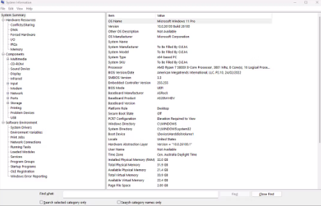

# Week 1 Journal – Computer Systems and Applications

**Student Name:** Yashwanth  
**GitHub:** https://github.com/yashwanth5050  
**Unit:** COIT20246 Networking and Cyber Security  
**Week:** 1  
**Topic:** Computer Systems and Applications

## Activity 1 – GitHub Journal Setup

### Objective

The first activity was to prepare the GitHub environment that I will use for my journal throughout the unit. I used my GitHub account `yashwanth5050` and prepared a private repository for the weekly journal. I also became familiar with the purpose of commits and Markdown files.

### Work Completed

I signed in to GitHub using my account at `https://github.com/yashwanth5050`. I created a new private repository for the journal and enabled a README file. I then organised the repository so that individual Markdown files could be used for each week.

The main repository structure I used was:

```text
COIT20246-Journal-Yashwanth/
├── README.md
├── Week01.md
├── Week02.md
├── Week03.md
└── images/
```

I used a private repository because the journal is an individual assessment. I also checked the repository settings so that the required tutor can be added as a collaborator.

### Evidence


**Figure 1.1 explanation:** This screenshot shows my GitHub account and the private repository created for the COIT20246 journal. It demonstrates that I am maintaining the journal through GitHub rather than as a standalone Word document.


**Figure 1.2 explanation:** This screenshot shows the repository file structure, including `README.md`, `Week01.md`, `Week02.md`, `Week03.md` and the `images` folder.

### What I Learned

I learned that GitHub is not only a place for source code but can also be used to maintain a chronological technical journal. Commits create a history of changes, which is useful for showing that the journal has been updated regularly. I also learned that a private repository allows controlled access to the journal while preventing it from being openly shared.

## Activity 2 – Basic Markdown Formatting

### Objective

The purpose of this activity was to learn how to format a journal using Markdown. I practised headings, bold text, lists, code blocks, links and images.

### Markdown Used

```markdown
# Main Heading

## Section Heading

**Bold text**

- Item 1
- Item 2

`inline command`

```text
Command output can be placed here.
```

[GitHub](https://github.com)


```

### Result

I created the Week 1 journal as a `.md` file and used headings to divide the work into activities. I used fenced code blocks for commands and output because this makes technical evidence much easier to read. I also learned that images stored inside the repository can be displayed directly in a Markdown document by using a relative path.

### Evidence


**Figure 1.3 explanation:** This screenshot shows the rendered `Week01.md` page on GitHub. It demonstrates that headings, code blocks and image links are being interpreted correctly as Markdown.

### What I Learned

The main difference between plain text and Markdown is that Markdown provides structure without requiring a word processor. I found it simple because the source remains readable even before GitHub renders it. This will also make the later journal entries consistent.

## Activity 3 – Inspecting the Windows Computer System with PowerShell

### Objective

The next activity was to inspect basic information about the computer system using Windows PowerShell. The aim was to connect the theoretical topic of computer systems with the hardware and operating system actually being used.

### Commands Used

I opened Windows PowerShell and first checked the computer name:

```powershell
hostname
```

Example output:

```text
YASHWANTH-PC
```

I then used the following command to display Windows system information:

```powershell
systeminfo
```

The command displayed information including the operating system, system manufacturer, system model, processor details, memory and network-related information.

I also checked processor information using:

```powershell
Get-CimInstance Win32_Processor | Select-Object Name, NumberOfCores, NumberOfLogicalProcessors
```

I checked physical memory using:

```powershell
Get-CimInstance Win32_ComputerSystem | Select-Object TotalPhysicalMemory
```

Finally, I checked the Windows version using:

```powershell
Get-ComputerInfo | Select-Object WindowsProductName, WindowsVersion, OsArchitecture
```

### Evidence



**Figure 1.4 explanation:** This screenshot shows the `systeminfo` command running in PowerShell and displays information about my Windows operating system and computer.


**Figure 1.5 explanation:** This screenshot shows PowerShell commands used to inspect processor and Windows details.

### Interpretation

The activity showed me that an operating system provides tools for obtaining information about the underlying hardware. PowerShell commands can retrieve system information directly, which is more efficient than opening several graphical settings pages.

I also understood the distinction between physical processor cores and logical processors. Logical processors are the processing units exposed to the operating system, while physical cores refer to the actual hardware cores on the CPU.

## Activity 4 – Processes and Applications

### Objective

The aim was to see how applications running on the computer are represented as processes.

### Commands Used

I listed running processes using:

```powershell
Get-Process
```

To view processes using the most CPU time, I used:

```powershell
Get-Process | Sort-Object CPU -Descending | Select-Object -First 10
```

To inspect memory usage, I used:

```powershell
Get-Process | Sort-Object WorkingSet -Descending | Select-Object -First 10 Name, Id, WorkingSet
```

### Evidence


**Figure 1.6 explanation:** The screenshot shows a list of processes running on my computer. The information includes process names and identifiers.

### Interpretation

I learned that an application may be represented by one or more processes and that the operating system is responsible for allocating processor time and memory to these processes. The process identifier is useful because it gives the operating system a unique way to refer to each running process.

## Problems and Troubleshooting

The main issue I encountered was that PowerShell produced a large amount of output for commands such as `systeminfo` and `Get-Process`. I solved this by filtering the output with `Select-Object` and sorting it with `Sort-Object`. This produced smaller results that were easier to interpret and capture as evidence.

I also checked my Markdown image paths carefully. Relative paths must match the exact filename stored in the repository. If the filename or folder name is incorrect, GitHub displays a broken image instead of the screenshot.

## Weekly Reflection

Week 1 gave me a clearer understanding of both the assessment workflow and the computer system I am using. Setting up GitHub first was useful because I can now document later activities immediately rather than reconstructing them at the end of the term.

The PowerShell activities helped me connect basic computer architecture concepts with a real operating system. Instead of thinking of the processor, memory and applications as separate theoretical topics, I could see how Windows reports and manages these resources. I also became more comfortable using command-line tools and filtering their output.

The most useful skill from this week was learning how to document technical work in Markdown. I can now combine commands, explanations and screenshots in one structured journal entry.
