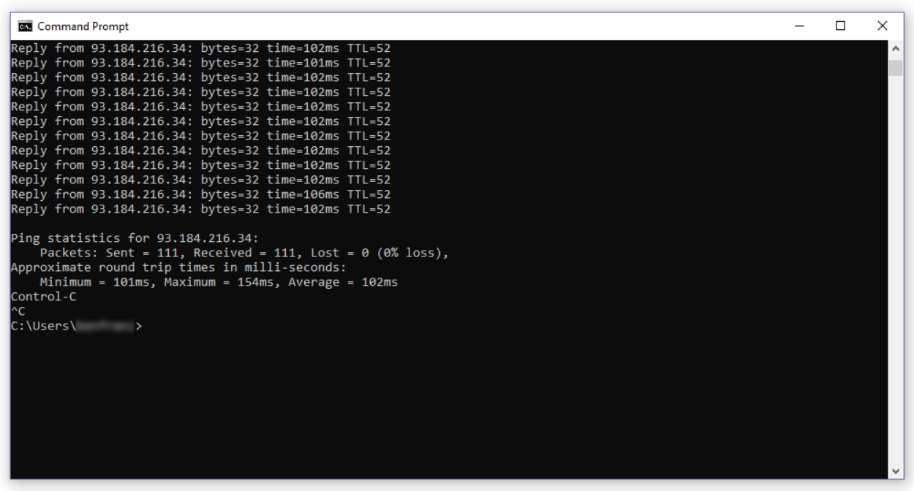
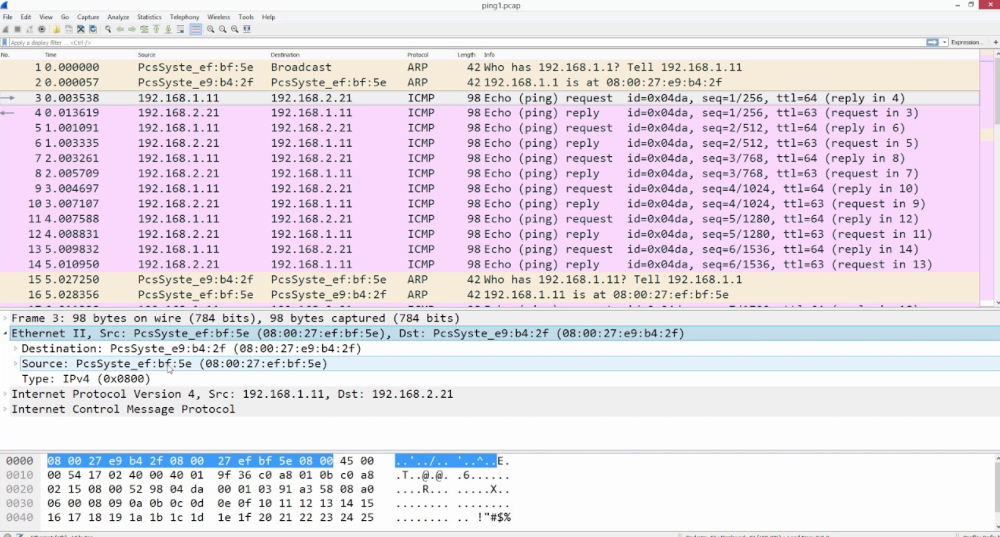

# Week 2 Journal – Computer Networks and the Internet

**Student Name:** Yashwanth  
**GitHub:** https://github.com/yashwanth5050  
**Unit:** COIT20246 Networking and Cyber Security  
**Week:** 2  
**Topic:** Computer Networks and the Internet

## Activity 1 – Inspecting Network Configuration

### Objective

The first Week 2 activity was to identify the current network configuration of my Windows computer. I wanted to determine the active network adapter, IP address, subnet mask or prefix, default gateway and DNS configuration.

### Commands Used

I opened PowerShell and used:

```powershell
ipconfig
```

For more detailed information I used:

```powershell
ipconfig /all
```

I also used a PowerShell command to display IP configuration in a more structured form:

```powershell
Get-NetIPConfiguration
```

To view available network adapters, I used:

```powershell
Get-NetAdapter
```

### Observations

The output showed that my computer has one or more network interfaces. Only an active interface is normally used for the current Internet connection. The active interface has an IP address and a default gateway.

I understood the default gateway as the router used to send traffic from the local network towards destinations that are outside the local subnet. The DNS server is used to translate domain names into IP addresses.

### Evidence


**Figure 2.1 explanation:** This screenshot shows the IP configuration of my active network interface, including the local IP address and default gateway.


**Figure 2.2 explanation:** This screenshot shows the network adapters detected by Windows and indicates which adapter is currently active.

## Activity 2 – Testing Connectivity with Ping

### Objective

The purpose of this activity was to test communication at different stages of the network path.

### Commands Used

I first tested the TCP/IP stack on the local machine:

```powershell
ping 127.0.0.1
```

I then tested communication with the local default gateway. I obtained the gateway address from `ipconfig` and used:

```text
ping <default-gateway-address>
```

I tested external IP connectivity using:

```powershell
ping 8.8.8.8
```

Finally, I tested a domain name:

```powershell
ping www.google.com
```

### Interpretation

A successful ping to `127.0.0.1` confirms that the local TCP/IP implementation is operating. A successful ping to the default gateway indicates that my computer can reach the local router. A successful ping to an external IP address indicates that the connection extends beyond the local network.

When a hostname is used instead of a raw IP address, name resolution must also occur. Therefore, testing both an IP address and a domain name can help identify whether a problem is related to connectivity or DNS.

### Evidence



**Figure 2.3 explanation:** This screenshot shows ping tests used to verify local TCP/IP operation, local gateway connectivity and Internet connectivity.

## Activity 3 – Tracing the Route to an Internet Destination

### Objective

The aim of this activity was to observe that Internet traffic normally passes through multiple routers before reaching a remote destination.

### Command Used

```powershell
tracert www.google.com
```

I also tried:

```powershell
tracert 8.8.8.8
```

### Observation

The command displayed a sequence of hops. Each hop represents a router or network device involved in forwarding the packet towards the destination. The first hop was associated with the local network or gateway, while later hops belonged to upstream networks.

Some hops may display `Request timed out`. I learned that this does not automatically mean the route is broken. Some routers are configured not to reply to the probe packets used by `tracert`, while still forwarding normal traffic.

### Evidence


**Figure 2.4 explanation:** This screenshot shows multiple hops between my computer and a remote Internet destination, demonstrating that Internet communication is routed through intermediate devices.

## Activity 4 – DNS Name Resolution

### Objective

The objective was to examine how a hostname is translated into an IP address.

### Commands Used

```powershell
nslookup www.cqu.edu.au
```

I also used:

```powershell
Resolve-DnsName www.cqu.edu.au
```

### Interpretation

The output returned DNS information associated with the requested hostname. I learned that people normally use memorable hostnames, while network communication ultimately depends on IP addresses. DNS provides the mapping between the two.

The DNS server itself is also an important part of network configuration. If the Internet connection works using raw IP addresses but domain names cannot be resolved, DNS configuration becomes an important troubleshooting area.

### Evidence


**Figure 2.5 explanation:** This screenshot shows a DNS query and the address information returned for the requested hostname.

## Activity 5 – Capturing Network Traffic with Wireshark

### Objective

The purpose of this activity was to use Wireshark to see network traffic instead of only relying on command output.

### Procedure

I opened Wireshark and selected the network interface that showed active traffic. I started a capture and then generated traffic by running a ping command:

```powershell
ping 8.8.8.8
```

I stopped the capture and used the following display filter:

```text
icmp
```

This reduced the visible packets to ICMP traffic.

I selected an ICMP Echo Request and examined the protocol layers shown by Wireshark. I then selected the corresponding Echo Reply.

### Observations

The capture showed request and reply packets associated with the ping operation. I could see that Wireshark presents packet data as a hierarchy, including frame information and network-layer information.

This helped me understand that a command such as `ping` creates actual packets that can be observed as they pass through the network interface.

### Evidence



**Figure 2.6 explanation:** This screenshot shows ICMP Echo Request and Echo Reply packets captured after running a ping test.

## Problems and Troubleshooting

At first, Wireshark displayed a large number of packets that were unrelated to my test. I used the `icmp` display filter to reduce the packet list to the traffic I wanted to analyse.

I also noticed that ping results can vary depending on firewall rules and whether a remote host responds to ICMP. I therefore interpreted a failed ping carefully instead of assuming that the Internet connection was completely unavailable.

## Weekly Reflection

Week 2 helped me understand how the different components of Internet communication fit together. Before the practical work, commands such as `ipconfig`, `ping`, `tracert` and `nslookup` seemed like separate utilities. After completing the activities, I could see that they test different stages of communication.

`ipconfig` describes the local configuration, `ping` tests reachability, `tracert` provides visibility into the route, and `nslookup` or `Resolve-DnsName` examines DNS. Wireshark then provides a deeper view by showing the packets generated by these activities.

The most important lesson for me was that network troubleshooting should be systematic. Instead of immediately blaming the Internet connection, it is better to check the local interface, local gateway, external IP connectivity and DNS separately.
