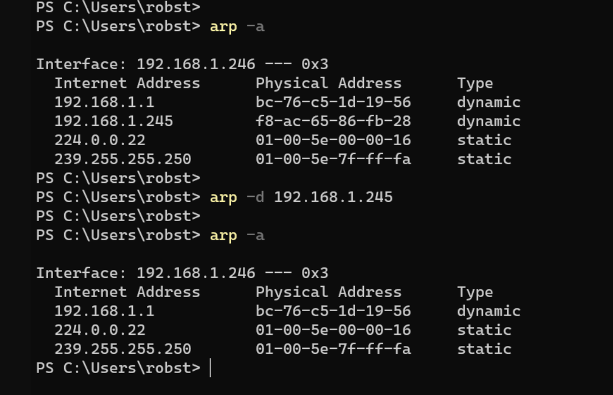
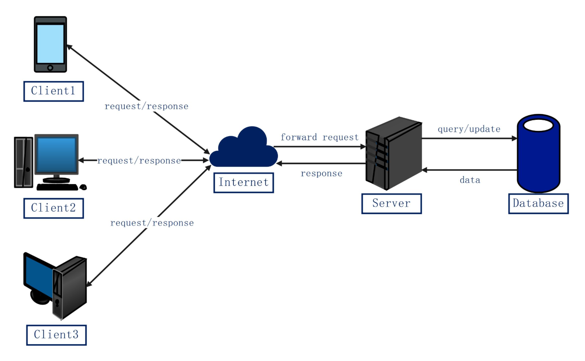
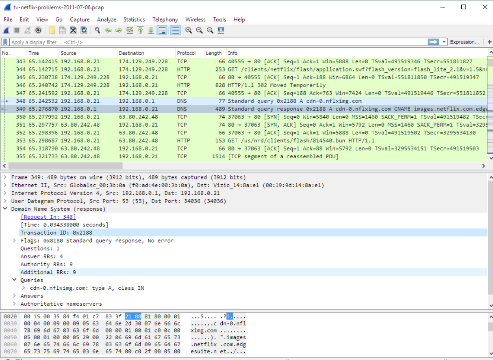

# Week 3 Journal – Network Technologies

**Student Name:** Yashwanth  
**GitHub:** https://github.com/yashwanth5050  
**Unit:** COIT20246 Networking and Cyber Security  
**Week:** 3  
**Topic:** Network Technologies

## Activity 1 – Viewing and Modifying the ARP Cache

### Objective

The purpose of this activity was to examine the ARP cache on a Windows system and observe the relationship between IPv4 addresses and physical MAC addresses. I also observed how a dynamic ARP entry can be removed.

### Commands Used

The PowerShell screenshot shows the following command used to display the ARP cache:

```powershell
arp -a
```

The initial output shows the interface:

```text
Interface: 192.168.1.246 --- 0x3
```

It also shows several Internet Address and Physical Address mappings, including:

```text
192.168.1.1     bc-76-c5-1d-19-56     dynamic
192.168.1.245   f8-ac-65-86-fb-28     dynamic
224.0.0.22      01-00-5e-00-00-16     static
239.255.255.250 01-00-5e-7f-ff-fa     static
```

The screenshot then shows the following command:

```powershell
arp -d 192.168.1.245
```

After deleting that entry, `arp -a` was run again. The entry for `192.168.1.245` was no longer present.

### Evidence



**Figure 3.1 explanation:** This screenshot shows the ARP cache for interface `192.168.1.246`. It includes dynamic and static address mappings. The command `arp -d 192.168.1.245` removes the dynamic entry for `192.168.1.245`, and the second `arp -a` output confirms that the entry is no longer listed.

### Interpretation

The activity demonstrated that the ARP cache stores mappings between IPv4 addresses and MAC addresses. The dynamic entries are learned automatically, while the static multicast-related entries remain listed.

Deleting `192.168.1.245` from the ARP cache showed that individual dynamic mappings can be removed manually. This helped me understand that ARP information is maintained locally by the operating system and can change as devices communicate on the network.

## Activity 2 – Creating and Interpreting a Client–Server Network Diagram

### Objective

The purpose of this activity was to represent a basic client–server architecture visually and understand how multiple clients communicate with a server and database through the Internet.

### Diagram Description

The uploaded network diagram contains three clients:

```text
Client1
Client2
Client3
```

Each client communicates through the Internet using a request/response relationship. The Internet then forwards the request to a server.

The server communicates with a database using:

```text
query/update
```

and the database returns:

```text
data
```

The server then sends a response back through the Internet to the clients.

### Evidence



**Figure 3.2 explanation:** This diagram shows three clients communicating through the Internet with a server. The server forwards queries or updates to a database, receives data back, and returns responses to the clients.

### Interpretation

The diagram helped me understand the separation of responsibilities in a client–server system. The clients initiate requests, while the server processes those requests and communicates with the database when information needs to be retrieved or updated.

The database is not shown communicating directly with the clients. Instead, the server acts as the intermediate component. This makes the flow of communication easier to understand because client requests are handled by the server before data is accessed.

## Activity 3 – Examining DNS and Application Traffic in Wireshark

### Objective

The purpose of this activity was to inspect captured network traffic in Wireshark and identify how DNS traffic appears alongside TCP and HTTP communication.

### Work Completed

The Wireshark screenshot shows a packet capture named:

```text
tv-netflix-problems-2011-07-06.pcap
```

The visible packets include TCP, HTTP and DNS traffic.

One DNS request is shown from:

```text
Source:      192.168.0.21
Destination: 192.168.0.1
Protocol:    DNS
```

The request information includes:

```text
Standard query 0x2188 A cdn-0.nflximg.com
```

The following DNS response is shown from:

```text
Source:      192.168.0.1
Destination: 192.168.0.21
Protocol:    DNS
```

The response information includes a CNAME relationship involving:

```text
cdn-0.nflximg.com
images.netflix.com
```

The selected DNS response packet also shows:

```text
User Datagram Protocol
Src Port: 53
Dst Port: 34036
```

and the DNS details indicate:

```text
Flags: 0x8180 Standard query response, No error
Questions: 1
Answer RRs: 4
Authority RRs: 9
Additional RRs: 9
```

### Evidence



**Figure 3.3 explanation:** This screenshot shows a Wireshark packet capture containing DNS, TCP and HTTP traffic. The selected DNS response is sent from `192.168.0.1` to `192.168.0.21` and contains a successful response for `cdn-0.nflximg.com`.

### Interpretation

This activity showed me how DNS operates as part of normal application communication. Before a client can access content using a hostname, the hostname may need to be resolved to network addressing information.

The packet capture also shows that DNS traffic appears alongside TCP and HTTP packets. This helped me understand that accessing an Internet-based service can involve several protocols working together rather than a single protocol operating in isolation.

The selected DNS packet uses UDP source port 53, which made it easier to identify it as DNS traffic. The response also reports “No error,” showing that the DNS query was answered successfully.

## Problems and Troubleshooting

The main challenge was interpreting different types of information from the screenshots. The ARP cache output uses IPv4-to-MAC mappings, while the Wireshark capture contains DNS, TCP and HTTP traffic. I separated the activities according to what was actually visible in each screenshot rather than treating them as the same networking process.

I also noticed that the Wireshark screenshot filename suggests ARP, but the visible packet content is DNS, TCP and HTTP traffic. I therefore based the journal entry on the actual packet contents shown in Wireshark.

## Weekly Reflection

Week 3 improved my understanding of several network technologies by showing them through different forms of evidence. The ARP activity demonstrated how a Windows computer stores mappings between IPv4 addresses and physical addresses and how a dynamic ARP entry can be removed.

The client–server diagram helped me understand how requests move from clients through the Internet to a server and how the server interacts with a database before returning a response. This made the logical flow of a networked application easier to visualise.

The Wireshark activity showed a different part of networking by demonstrating DNS, TCP and HTTP traffic in the same capture. I learned that accessing an Internet service can involve name resolution and application communication working together.

Overall, Week 3 helped me connect address resolution, client–server architecture and packet analysis. These activities made it clearer that network communication depends on several technologies operating at different stages of the communication process.
